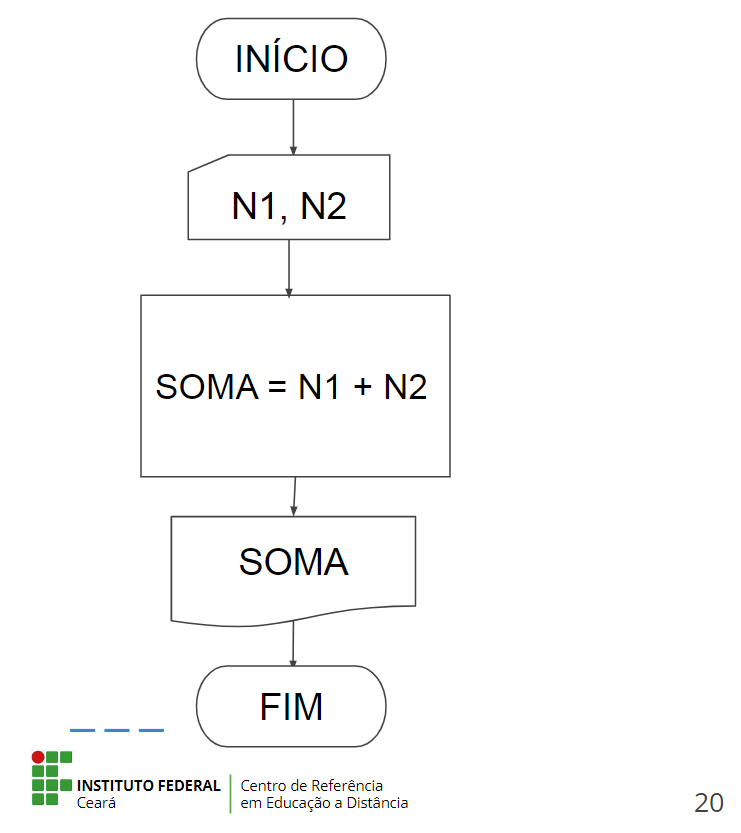

# Aula - Introdução à Programação

## Computador

- Hardware
- Software

## Etapas do Desenvolvimento de Software

- Análise
  - Entender o problema
  - Identificar as entradas
  - Definir a estratégia de processamento
  - Identificar as saídas
- Algoritmo
  - Definir a solução para o problema em forma de passos, com detalhes sobre seu processamento, entradas e saídas.
- Codificação
  - Escrever o algoritmo na linguagem de programação escolhida.

## O que é um Algoritmo?

> "Algoritmo é uma sequência de passos que visa atingir um objetivo bem definido" (Forbellone, 1999).

## Exemplo de Algoritmo

**Algoritmo para escovar os dentes:**

1. Molhar a escova
2. Aplicar pasta de dente
3. Escovar cada dente por determinado tempo
4. Enxaguar a escova
5. Guardar a escova

**Algoritmo para trocar uma lâmpada:**

1. Pegar a nova lâmpada
2. Pegar a escada
3. Posicionar a escada abaixo da lâmpada que deve ser trocada
4. Subir a escada de posse da nova lâmpada
5. Retirar a lâmpada queimada
6. Colocar a nova lâmpada
7. Descer da escada
8. Acionar o interruptor para testar a lâmpada
9. Guardar a escada
10. Descartar a lâmpada queimada

## Formas de Representação de um Algoritmo

- Descrição Narrativa
- Fluxograma
- Pseudocódigo

**Pergunta:** Escreva um algoritmo que solicite dois números inteiros como entrada e exiba sua soma na tela.

## Exemplo com Descrição Narrativa

1. Receber as duas notas
2. Calcular a soma
3. Exibir a soma

## Exemplo com Fluxograma



## Exemplo com Pseudocódigo

```js
let numero1 = Number(prompt("Digite um número inteiro: "));
let numero2 = Number(prompt("Digite outro número inteiro: "));

let somaDosDoisNumerosInteiros = numero1 + numero2;
alert(
  "A soma dos dois números inteiros é igual a: " + somaDosDoisNumerosInteiros
);
```

## O que é um Programa?

Programa é um conjunto de instruções usadas por um computador para realizar determinada tarefa.

## Exemplos de Programas

- WhatsApp
- Telegram
- Instagram
- Facebook
- Twitter
- GMail
- YouTube
- Netflix
- MacOS
- Windows
- Linux
- Eclipse
- Visual Studio Code

## O que é uma Linguagem de Programação?

> Segundo a definição da IEEE, "uma linguagem de programação é um conjunto de símbolos e regras sintáticas e semânticas usados para definir um programa de computador".

## Tipos de Linguagens de Programação

- Alto nível
- Baixo nível

## O que são Paradigmas de Programação?

São um conjunto de conceitos e técnicas que definem como um programa deve ser organizado e escrito.

## Para que servem esses Paradigmas?

Esses paradigmas fornecem uma maneira de pensar e abordar problemas de programação, e incluem diferentes abordagens para modelar a solução de um problema.

## Exemplos de Paradigmas de Programação

- Paradigma Imperativo
- Paradigma Orientado a Objetos
- Paradigma Funcional
- Paradigma Lógico
- Paradigma de Programação Concorrente

## Programação Estruturada

A programação estruturada também enfatiza a modularidade, dividindo o código em pequenos blocos de construção chamados de procedimentos ou funções.

Esses blocos de construção podem ser reutilizados em diferentes partes do programa, o que ajuda a tornar o código mais eficiente e fácil de manter.

Linguagens de programação que utilizam a programação estruturada incluem C, Pascal e Ada.

A programação estruturada é amplamente utilizada em programação de sistemas operacionais.

## Exemplo de Programa Estruturada

Exemplo de programa estruturado em JavaScript que solicita ao usuário um número e verifica se ele é par ou ímpar:

```js
let numero = Number(prompt("Digite um número: "));

if (numero % 2 == 0) {
  alert("O número digitado é par.");
} else {
  alert("O número digitado é ímpar.");
}
```

## Compilador

**Etapas do processo de compilação:**

- Análise léxica
- Análise sintática
- Análise semântica
- Otimização de código
- Geração de código objeto

O resultado final é um arquivo executável que pode ser executado diretamente em um computador ou máquina virtual.

## Exemplos de Linguagens Compiladas

**Alguns exemplos de linguagens compiladas incluem:**

- C, C++ e Objetive C
- Fortran
- Swift
- Rust
- Pascal
- Ada

## Interpretador

O interpretador executa o programa linha por linha, verificando cada comando e instrução para ver se ele pode ser executado.

Se o comando é válido, o interpretador executa a instrução associada.

Se houver um erro, o interpretador geralmente interrompe a execução do programa e apresenta uma mensagem de erro ao usuário.

## Exemplos de Linguagens Interpretadas

**Alguns exemplos de linguagens interpretadas incluem:**

- Python
- Ruby
- JavaScript
- Perl

## Tipos de Dados

Tipos de dados referem-se aos diferentes tipos de valores que podem ser armazenados e manipulados em um programa de computador.

## Tipos de Dados Básicos

- **Inteiros:** números inteiros, como -10, 0, 42, etc.
- **Números de ponto flutuante:** números com casas decimais, como 3.14, 0.5, etc.
- **Booleanos:** valores lógicos verdadeiros ou falsos, representados por true ou false.
- **Caracteres:** caracteres únicos, como 'a', 'Z', '?', etc.
- **Strings:** sequências de caracteres, como "Olá, mundo!" ou "1234".

## Tipos de Dados Mais Complexos

- **Arrays:** coleções de valores do mesmo tipo, como [1, 2, 3, 4] ou ["maçã", "banana", "laranja"].
- **Ponteiros:** valores que apontam para posições de memória, usados para trabalhar com estruturas de dados mais complexas.
- **Estruturas:** tipos de dados personalizados que contêm vários campos, como um registro em um banco de dados.
